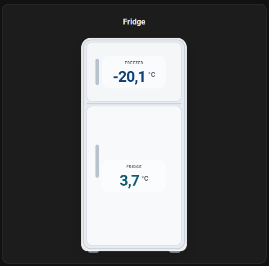

# HA Fridge Card

A Lovelace custom card for Home Assistant that shows freezer and fridge temperatures in a clean, minimal fridge illustration.

## Preview



## Features

- Simple Home Assistant-style visual
- Multiple fridge layouts: `default`, `inverted`, `dual_door`, `freezer`
- Visual editor support in Lovelace
- Works with one or two sensors: `freezer_entity` and/or `fridge_entity`
- Clickable temperature readings that open the Home Assistant entity history/more-info dialog
- Graceful fallback for missing, `unknown`, and `unavailable` entities
- Installable with HACS as a custom `Dashboard` repository

## Installation with HACS

1. Open HACS.
2. Go to the custom repositories menu.
3. Add the URL of this repository.
4. Select `Dashboard` as the category.
5. Install `HA Fridge Card`.
6. Restart Home Assistant if requested.

If the resource is not added automatically, add it manually:

```yaml
lovelace:
  resources:
    - url: /hacsfiles/ha-fridge-card/ha-fridge-card.js
      type: module
```

## Manual installation

1. Copy `dist/ha-fridge-card.js` to:
   `/config/www/community/ha-fridge-card/ha-fridge-card.js`
2. Add the resource:

```yaml
lovelace:
  resources:
    - url: /local/community/ha-fridge-card/ha-fridge-card.js
      type: module
```

## Usage

```yaml
type: custom:ha-fridge-card
title: Fridge
layout: default
freezer_entity: sensor.freezer_temperature
fridge_entity: sensor.fridge_temperature
```

## Options

| Name | Required | Description |
| --- | --- | --- |
| `freezer_entity` | No* | Entity ID for the freezer temperature sensor |
| `fridge_entity` | No* | Entity ID for the fridge temperature sensor |
| `title` | No | Card title. Default: `Fridge` |
| `layout` | No | Fridge illustration layout. Options: `default`, `inverted`, `dual_door`, `freezer` |

\* Configure at least one of `freezer_entity` or `fridge_entity`. When `layout: freezer`, `freezer_entity` is required.

## Notes

- The card reads `unit_of_measurement` from each entity.
- If a unit is missing, it falls back to `°C`.
- If an entity is missing or unavailable, the card shows `--`.
- If only one entity is configured, the card hides the other temperature zone automatically.

## HACS Validation

This repository includes a HACS validation workflow in [.github/workflows/hacs.yaml](.github/workflows/hacs.yaml).

## Releases

For stable HACS distribution, publish GitHub Releases with an updated `dist/ha-fridge-card.js`.
